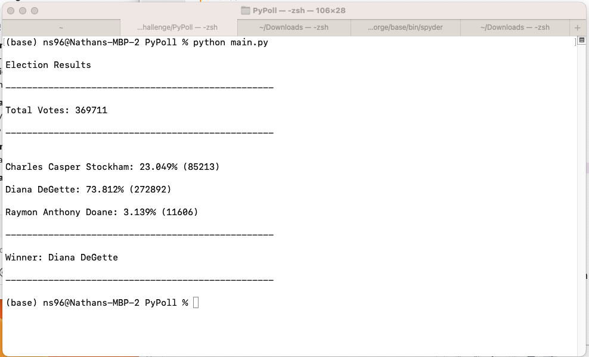

# Python Challenge
Python Code Challenge for Analyzing Financial and Election Data

## Introduction
This project contains two Python scripts which analyze financial and election data stored in csv files.  For the financial data the script extracted the total number of months, the "Profit/Losses" net amount, and the average changes in "Profit/Losses" over a period (i.e a month).  Additionally, the greatest increase and decrease in profits was also obtained.

For the election data the total number of votes, list of candidates with their total/votes percentage was extracted. Also based on this data, the winner was then identified.

Furthermore, the scripts not only printed the analysis results to the Terminal window, but also saves them to a text file.

## Results
Financial Dataset:
 

Election Dataset:
 